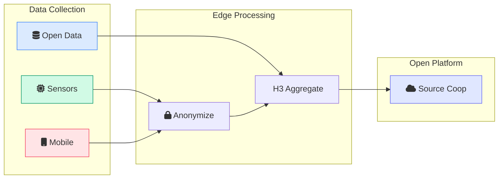
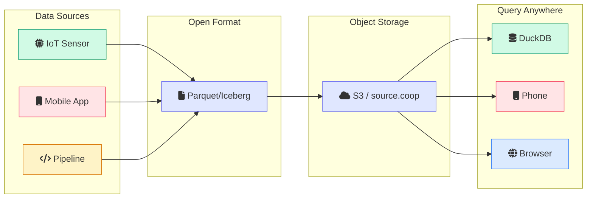
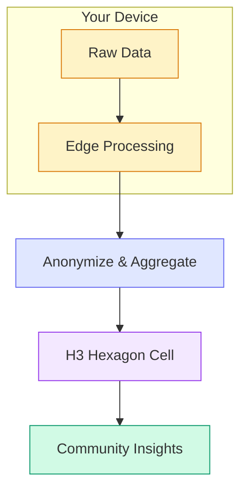

```mermaid {scale: 0.5}
flowchart LR
    A[fa:fa-users Community] -->|Submit PR| B[fa:fa-code-branch GitHub]
    B -->|CI Validates| C[fa:fa-server Hetzner Runner]
    C -->|DuckDB SQL| D[fa:fa-database DuckLake]
    D -->|Open Format| E[fa:fa-cloud S3 / source.coop]
    E -->|Query| F[fa:fa-globe Anyone]
    style A fill:#d1fae5,stroke:#059669
    style E fill:#e0e7ff,stroke:#6366f1
    style F fill:#fef3c7,stroke:#d97706
```

# Walkthru.earth

Cities Built for People

Revealing the hidden patterns of daily life

  <a href="https://walkthru.earth" target="_blank" class="btn btn-primary btn-pill btn-sm">
    Visit Website
  </a>
  <a href="https://opensensor.space" target="_blank" class="btn btn-outline btn-pill btn-sm">
    OpenSensor.Space
  </a>

---

# The City is Processing You

**Every day, you walk through your city.** You notice the traffic, the buildings, and the shops, but you likely don't notice what the environment is doing to **you**.

  

    

    Walking
  

  

  

    

    Processing
  

  

  

    

    Impact
  

  <strong>Walkthru.earth</strong> believes cities should be built for <strong>people</strong>

  

    
  

---

# The Invisible Problem

**Current cities are measured by spreadsheets, not feelings.**

We track GDP, property values, and traffic flow, but these metrics tell us nothing about whether:

  

    

    A child is thriving
  

  

    

    A resident is chronically stressed
  

  

    

    A neighborhood is truly livable
  

  

Survival Mode

Because we ignore these "hidden patterns," our bodies often stay in <strong>survival mode</strong>.

Chronic noise and pollution keep our **cortisol levels high** and our nervous systems on edge.

---
layout: center
---

  

# The Analogy

Today, cities only check their **"bank balance" (GDP)** to see if they are doing well.

  

    

    
GDP Only

  

  

  

    

    
Full Health

  

Walkthru.earth is like a fitness tracker for the whole city.

We allow a city to finally check its <strong>"heart rate"</strong> and <strong>"stress levels"</strong> so it can actually help the people inside it get healthy.

---
layout: center
---

# Making the Invisible Visible

Our mission is simple:

"Reveal the hidden patterns of daily life and turn them into solutions."

  

  
Air Quality

  

  
Noise > 65dB

  

  
Green Space

We provide the <strong>"human layer"</strong> of urban intelligence

---

# How We Do It

To measure what matters, we've built <strong>three complementary tools</strong> — each capturing a different dimension of urban life:

  

    

  

  
OpenSensor.Space

  

    A network of DIY stations providing <strong>real-time data</strong> on air, noise, and light
  

  
✓ Live with 2 stations

  

    

  

  
Livability Index

  

    A score based on <strong>50+ factors</strong> including food, water, and school access
  

  
In development

  

    

  

  
Hormones & Cities

  

    Measuring how urban design affects <strong>human behavior and emotions</strong>
  

  
App ready

---

# Where Does the Data Come From?

We combine <strong>three layers</strong> of data to build a complete picture of urban livability

  

    

    
IoT Sensors

  

  

    

      

      Raspberry Pi, Jetson, Edge devices
    

    

      

      Air quality (PM2.5, PM10)
    

    

      

      Temperature, humidity, noise
    

    

      

      Light levels (lux)
    

  

  
Edge processing → Anonymous upload

  

    

    
Mobile App

  

  

    

      

      Wellbeing surveys (mood, stress)
    

    

      

      Community feedback
    

    

      

      AI-guided reflection
    

    

      

      Location aggregated to H3 cells
    

  

  
100% anonymous • No account needed

  

    

    
Open Data

  

  

    

      

      LandScan population (90m)
    

    

      

      Overture Maps (64M+ POIs)
    

    

      

      OpenStreetMap infrastructure
    

    

      

      Foursquare Places
    

  

  
Schools, hospitals, transit, green spaces

---

# OpenSensor.Space — Live Now

Our first tool is <strong>already deployed</strong> — real-time environmental sensing running for over a year

  <iframe
    src="https://opensensor.space/"
    class="w-full h-full"
    frameborder="0"
    allow="accelerometer; autoplay; clipboard-write; encrypted-media; gyroscope"
  ></iframe>

  

    

      

      2 stations live
    

    

      

      1+ year of data
    

  

  <a href="https://opensensor.space" target="_blank" class="btn btn-link text-sm">
    Open in new tab 
  </a>

---

# Why Rebuild the Stack?

Existing tools weren't designed for <strong>open, collaborative urban data</strong>

  

  
Data Duplication

  

    Every org rebuilds the same pipelines for public data
  

  

  
Vendor Lock-in

  

    Proprietary formats trap data in silos
  

  

  
Not Analysis-Ready

  

    Raw data needs ETL before any insights
  

  

  
Energy Waste

  

    Always-on servers for intermittent data
  

  

    

    Our Approach
  

  

    

      

      <strong>Open formats</strong> — Parquet, GeoParquet, Iceberg
    

    

      

      <strong>Analysis-ready</strong> — DuckDB, Spark, Python
    

    

      

      <strong>AI-ready</strong> — ML pipelines & embeddings
    

    

      

      <strong>Serverless</strong> — No idle costs, pay for compute
    

  

  <strong>Result:</strong> 60-90% less energy • Zero data loss • No vendor lock-in • Ready for AI

---

# Cloud-Native Everywhere

The same architecture powers <strong>all our tools</strong> — from edge sensors to mobile apps

  

    

    
IoT Sensors

  

  

    

      

      Raspberry Pi → Parquet → S3
    

    

      

      No MQTT, no database servers
    

    

      

      Offline-first, zero data loss
    

  

  

    

    
Mobile App

  

  

    

      

      DuckDB runs on your phone
    

    

      

      Query Iceberg/DuckLake directly
    

    

      

      No backend API needed
    

  

  

    

    
Data Pipelines

  

  

    

      

      Ephemeral runners (no servers)
    

    

      

      DuckDB SQL transformations
    

    

      

      Output to open formats
    

  

  <strong>The insight:</strong> One architecture, many devices — no servers in between

---

# Hormones & Cities App

Capturing the <strong>human experience</strong> of your city — completely anonymously

  

    

      
    

    

    

    

      

    

  

  
Survey Categories

  
Housing, wellbeing, community

  

    

      
    

    

    

    

      

    

  

  
AI Reflection

  
Guided conversations

  

    

      
    

    

    

    

      

    

  

  
City Pulse Dashboard

  
Community trends

  

    

    No account required
  

  

    

    No personal data stored
  

  

    

    Location aggregated
  

---

# Privacy by Design

Your data helps cities improve. Your <strong>identity</strong> stays yours.

  

    

    
Edge Computation

  

  

    Data is <strong>processed on-device</strong> before upload. Your raw data never leaves your phone or sensor.
  

  

    

    
Anonymous Upload

  

  

    <strong>No account required</strong>. No email, no personal data stored. Responses are untraceable.
  

  

    

    
H3 Spatial Aggregation

  

  

    Location aggregated to <strong>~500m hexagonal cells</strong>. We measure neighborhoods, not individuals.
  

  

    

    
No Tracking

  

  

    No cookies, no fingerprinting, no behavioral tracking. Just <strong>honest urban data</strong>.
  

---

# Why We Are "Open"

We believe urban data should be <strong>public infrastructure</strong>, just like roads and bridges.

  

    

    
Trust & Transparency

  

  

    All code on <a href="https://github.com/walkthru-earth" target="_blank" class="text-green-600 underline">GitHub</a>. Every pipeline, model, and methodology can be <strong>verified and audited</strong> by anyone.
  

  

    

    
Reproducibility

  

  

    Any researcher can <strong>reproduce our findings</strong> using the same data and code. Science that can't be replicated isn't science.
  

  

    

    
Global Equity

  

  

    A community in <strong>Dhaka</strong> has the same tools as <strong>Dubai</strong>. No paywalls, no gatekeepers, no privileged access.
  

  

    
    
Open Data Platform

  

  

    All datasets on <strong>Source Cooperative</strong> — a non-profit platform where data is a public good, not a product.
  

  

    

    
Community-Driven

  

  

    Anyone can <strong>contribute new data sources</strong>, improve pipelines, or extend the platform. This is collective infrastructure.
  

  

    

    
Accountability

  

  

    Open data means <strong>no hidden agendas</strong>. If our methods are flawed, the community will find and fix them.
  

  

    <strong>"Closed data creates closed cities."</strong> We're building the opposite — infrastructure that belongs to everyone.
  

---

# Who Benefits?

We turn data into <strong>actionable insights</strong> for everyone

<!-- Left column -->

  

    

  

  
Families

  
Healthy neighborhoods

  

    

  

  
Planners

  
Evidence for parks

  

    

  

  
Investors

  
ESG reporting

<!-- Center - The Individual (largest) -->

  

    

  

  
You

  

    Know what your city is doing to <strong>your health</strong>
  

<!-- Right column -->

  

    

  

  
Researchers

  
Open datasets

  

    

  

  
Policymakers

  
Health regulations

  

    

  

  
Communities

  
Advocate for change

  <strong>Everyone</strong> deserves to know what their environment is doing to them

---
layout: center
---

  

# The Data Sharing Challenge

  

    

    What Big Tech Solved
  

  

    

      

      Scalable object storage (S3, GCS, Azure)
    

    

      

      Open table formats (Apache Iceberg, DuckLake)
    

    

      

      Serverless query engines (DuckDB, Athena)
    

  

  

    

    What's Still Missing
  

  

    

      

      Open, collaborative pipeline design
    

    

      

      Simple way to contribute & maintain
    

    

      

      No duplication across organizations
    

  

  

    Every business builds their own infra to aggregate the <strong>same</strong> public datasets.
  

  

    What if there was a Homebrew for public data pipelines?
  

---
layout: center
---

  

# Walkthru Data

  A <strong>conda-forge style registry</strong> for public data pipelines

  

  
Git-Based

  
PR workflow for governance

  

  
Simple SQL

  
DuckDB + DuckLake

  

  
98% Cheaper

  
Ephemeral runners

  

    

    

      
Work in Progress — We Need Help

      

        This is a <strong>hard infrastructure challenge</strong> that requires significant effort.
        It's currently blocking our <strong>50+ Hormones & Cities indices</strong> from going live.
      

      

        

        Looking for contributors, sponsors, and partners
      

    

  

---
layout: center
---

<!-- Left: Content -->

# Join the Path

  <a href="https://opensensor.space/join-network/" target="_blank" class="no-underline text-inherit block">
    

    
Deploy a Sensor

  </a>

  <a href="https://source.coop/walkthru-earth" target="_blank" class="no-underline text-inherit block">
    
    
Access Our Data

  </a>

  <a href="https://github.com/walkthru-earth" target="_blank" class="no-underline text-inherit block">
    

    
Follow the Journey

  </a>

  <a href="https://walkthru.earth" target="_blank" class="text-xl font-bold no-underline" style="color: hsl(158 64% 52%)">walkthru.earth</a>
  

    <a href="mailto:hi@walkthru.earth" class="text-gray-500 no-underline hover:underline">hi@walkthru.earth</a>
  

  <a href="https://www.linkedin.com/company/walkthru-earth/" target="_blank" class="text-gray-400 hover:text-blue-600 transition-colors" title="LinkedIn">
    

  </a>
  <a href="https://www.youtube.com/@walkthru-earth/" target="_blank" class="text-gray-400 hover:text-red-500 transition-colors" title="YouTube">
    

  </a>
  <a href="https://www.instagram.com/walkthru.earth" target="_blank" class="text-gray-400 hover:text-pink-500 transition-colors" title="Instagram">
    

  </a>
  <a href="https://www.tiktok.com/@walkthru.earth" target="_blank" class="text-gray-400 hover:text-gray-800 transition-colors" title="TikTok">
    

  </a>
  <a href="https://www.facebook.com/walkthru.earth" target="_blank" class="text-gray-400 hover:text-blue-500 transition-colors" title="Facebook">
    

  </a>
  <a href="https://x.com/walkthru_earth" target="_blank" class="text-gray-400 hover:text-gray-800 transition-colors" title="X">
    

  </a>
  <a href="https://bsky.app/profile/walkthru.earth" target="_blank" class="text-gray-400 hover:text-blue-400 transition-colors" title="Bluesky">
    

  </a>
  

<!-- Right: Large QR Code -->

  

    
  

  

    
Scan to Connect

    
All links + these slides

  

