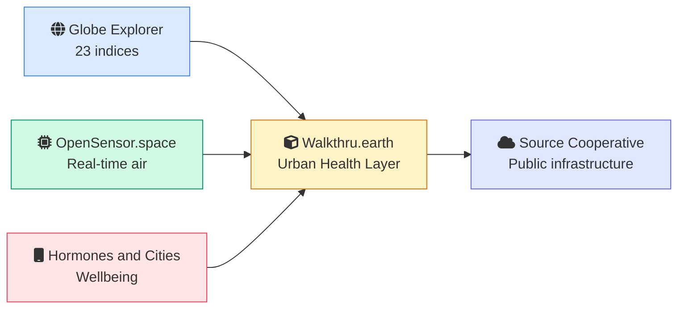

# Walkthru.earth

Urban Intelligence Infrastructure

"What is the city doing to the people inside it?"

  <a href="https://walkthru.earth" target="_blank" class="btn btn-primary btn-pill btn-sm">
    walkthru.earth
  </a>
  <a href="https://opensensor.space" target="_blank" class="btn btn-outline btn-pill btn-sm">
    opensensor.space
  </a>

Open source, starting in Cairo, designed to work anywhere

  
Swipe to begin

  

    

    

    

  

---
zoom: 1.2
---

# We are unaware of what cities do to us

Cities are measured obsessively. GDP, property values, traffic congestion, satellite imagery, mobility patterns.

None of those numbers tell you whether the air your child breathes is safe, whether the noise on your street is keeping your cortisol elevated, or whether your neighbourhood is actually liveable.

We optimise for economic output, then wonder why people feel worse.

  

    

    
Air your child breathes

  

  
No neighbourhood scale visibility into PM2.5, ozone, or particulates.

  

    

    
Noise that raises cortisol

  

  
Chronic stress signals are invisible to GDP and traffic counts.

  

    

    
Neighbourhoods quietly wearing people down

  

  
Heat, density, infrastructure strain interact, no one is measuring it.

When the signal is invisible, cities make billion dollar decisions with incomplete information.

---
layout: center
---

  

# A Fitness Tracker for Cities

Today, cities only check their <strong>bank balance</strong>, GDP, to see if they are doing well.

  

    

    
GDP only

  

  

  

    

    
Heart rate

  

  

    

    
Stress

  

  

    

    
Recovery

  

Walkthru.earth gives a whole city continuous health observability, at neighbourhood resolution, in real time.

---
zoom: 1.2
---

# Three Open Layers, One Platform

  

    

    
Globe Explorer

  

  
Spatial intelligence

  

    23 planetary indices. 300GB of terrain, population, buildings, and weather, joinable in a single SQL query, running directly in your browser.
  

  

    
 Public preview
  

  

    

    
OpenSensor.space

  

  
Environmental sensing

  

    A distributed network of low cost IoT sensors streaming real time air quality directly from street level. Hardware agnostic, serverless, anyone can join.
  

  

    
 Live in Cairo, 1+ year of data
  

  

    

    
Hormones & Cities

  

  
Lived experience

  

    A privacy first mobile app. Raw data never leaves the phone. What gets shared is an anonymous neighbourhood signal that sharpens as more people contribute.
  

  

    
 App ready
  

---

# Globe Explorer

A browser based spatial intelligence engine. Everything runs client side. No servers, no login, no cost to access.

  

    

    
23 Planetary Indices

  

  
Climate, hazard, vulnerability, accessibility, joined on a unified spatial grid.

  

    

    
300GB of Open Data

  

  
Terrain, population projections through 2100, building density, weather.

  

    

    
One SQL Query

  

  
DuckDB, GeoParquet, Iceberg, anything joinable in the browser.

  

    

    
Global Equity

  

  
A researcher in Nairobi and a planner in Amsterdam have exactly the same tools.

  

    

      

    

    

      
Why this matters

      Existing GIS stacks lock data in proprietary formats and behind paid licences. Globe Explorer treats public datasets as public infrastructure.
    

  

  

    Open formats, Parquet, GeoParquet, Iceberg. Analysis ready out of the box.
  

---
zoom: 1.2
---

# OpenSensor.space, Live in Cairo

Our environmental sensing layer is <strong>already deployed</strong>. Real time air quality, streaming continuously for over a year.

  <iframe
    src="https://opensensor.space/"
    class="w-full h-full"
    frameborder="0"
    allow="accelerometer; autoplay; clipboard-write; encrypted-media; gyroscope"
  ></iframe>

  
Real time signals

  
PM2.5, PM10, temperature, humidity, noise, light.

  
Hardware agnostic

  
Raspberry Pi, Jetson, anything Python capable.

  
Serverless architecture

  
Edge to Parquet to S3. No MQTT, no broker, no vendor lock in.

  
60 to 90 percent less energy

  
Than traditional always on IoT stacks.

  

    

      

      2 stations live in Cairo
    

    

      

      Same code deploys anywhere
    

  

  <a href="https://opensensor.space" target="_blank" class="btn btn-link text-sm">
    Open in new tab 
  </a>

---
zoom: 1.2
---

# Hormones & Cities

Capturing what sensors cannot, the lived experience of a city, completely anonymously.

  

    

      
    

    

    

    

      

    

  

  
Wellbeing Survey

  
Mood, stress, housing, community

  

    

      
    

    

    

    

      

    

  

  
AI Reflection

  
Guided conversations

  

    

      
    

    

    

    

      

    

  

  
City Pulse Dashboard

  
Neighbourhood trends

  

    

    
On device

    
Raw data never uploaded

  

  

    

    
Anonymous

    
No account, no email

  

  

    

    
H3 aggregated

    
~500m hex cells

  

  

    

    
Sharper with scale

    
Community signal

  

---
layout: full
---

  <HNCExplorer />

<!--
The HNC Explorer is rendered natively in this slide as a Vue component. Parquet, GLB hemispheres, parcel atlas, and AOI baselines are fetched from walkthru.earth at runtime. Fully interactive. Use the play/pause and 0.5x to 30x speed controls to walk frames. Click a marker on the map or a region in the radar to spotlight it. Caveat, static-clip means motion areas like MT/V5 under-fire, ventral-stream regions are honest. Code at github.com/walkthru-earth/hnc.
-->

---
zoom: 1.2
---

# Open by Design

  

    

    
Public Infrastructure

  

  

    We treat urban health data the same way we treat roads. <strong class="text-gray-800">Built once, used by everyone.</strong>
  

  

  

    
All Code on GitHub

    
Pipelines, models, methods.

  

  
  

    
Source Coop

    
Open formats, non-profit.

  

  

  

    
Same Tools, Anywhere

    
Dhaka, Amsterdam, the same.

  

  

  

    
Reproducible

    
Same data, same result.

  

  

  

    
Community-driven

    
Anyone can contribute.

  

  

  

    
Accountable

    
Open methods, open critique.

  

  Closed data creates closed cities. We are building the opposite.

---
zoom: 1.2
---

# Who This Serves

<!-- Audience labels row, aligned to the building silhouettes below -->

  

  
NGOs &amp; Funders

  
Programme targeting and impact measurement grounded in observable urban conditions, so funding decisions reflect what is actually happening on the ground rather than what reports claim.

  

  
Communities

  
Visibility into what their environment is doing to their air, sleep, and stress, plus a structured voice in the data so the people most affected help shape it.

  

  
Cities &amp; Public Health

  
Continuous neighbourhood-scale signals for policy, infrastructure, and climate adaptation, replacing one-off surveys with a live picture of how the city performs for residents.

  

  
Planners &amp; Architects

  
Evidence for parks, walkability, density, and where intervention will move the needle, so design decisions are anchored in the lived conditions of each block, not citywide averages.

  

  
Researchers

  
Open datasets and reproducible pipelines, free to query in the browser, free to extend, engineered so independent groups can replicate or challenge any finding end to end.

  

  
Investors &amp; ESG

  
Independent, auditable signals on environmental and social outcomes at neighbourhood resolution, giving capital allocators real urban data instead of self-reported corporate disclosures.

<!-- City silhouette: each building sits under its corresponding audience label.
     Soft sky gradient backdrop, ground horizon line, brand-tinted building tops. -->
<svg viewBox="0 0 1200 220" class="w-full mt-2" xmlns="http://www.w3.org/2000/svg" preserveAspectRatio="xMidYEnd meet">
  <defs>
    <linearGradient id="sky" x1="0" y1="0" x2="0" y2="1">
      <stop offset="0%" stop-color="#fef3c7" stop-opacity="0.0"/>
      <stop offset="100%" stop-color="#a7f3d0" stop-opacity="0.25"/>
    </linearGradient>
    <linearGradient id="ground" x1="0" y1="0" x2="0" y2="1">
      <stop offset="0%" stop-color="#94a3b8" stop-opacity="0.7"/>
      <stop offset="100%" stop-color="#94a3b8" stop-opacity="0.0"/>
    </linearGradient>
  </defs>

  <rect x="0" y="0" width="1200" height="220" fill="url(#sky)"/>

  <!-- 1. NGO/community office (teal): low pitched-roof building with flag -->
  <g>
    <line x1="100" y1="20" x2="100" y2="115" stroke="#0d9488" stroke-width="1" stroke-dasharray="2 3" opacity="0.5"/>
    <rect x="50" y="120" width="100" height="80" fill="#ccfbf1" stroke="#0d9488" stroke-width="2"/>
    <polygon points="50,120 100,90 150,120" fill="#5eead4" stroke="#0d9488" stroke-width="2"/>
    <line x1="100" y1="90" x2="100" y2="60" stroke="#0d9488" stroke-width="2"/>
    <polygon points="100,60 130,68 100,76" fill="#0d9488"/>
    <rect x="65" y="140" width="20" height="30" fill="#0d9488" opacity="0.2"/>
    <rect x="115" y="140" width="20" height="30" fill="#0d9488" opacity="0.2"/>
    <rect x="90" y="170" width="20" height="30" fill="#0d9488" opacity="0.5"/>
  </g>

  <!-- 2. Apartment block (rose): grid of windows, residential -->
  <g>
    <line x1="300" y1="20" x2="300" y2="75" stroke="#e11d48" stroke-width="1" stroke-dasharray="2 3" opacity="0.5"/>
    <rect x="240" y="80" width="120" height="120" fill="#ffe4e6" stroke="#e11d48" stroke-width="2"/>
    <g fill="#e11d48" opacity="0.35">
      <rect x="252" y="92" width="14" height="18"/>
      <rect x="276" y="92" width="14" height="18"/>
      <rect x="300" y="92" width="14" height="18"/>
      <rect x="324" y="92" width="14" height="18"/>
      <rect x="252" y="120" width="14" height="18"/>
      <rect x="276" y="120" width="14" height="18"/>
      <rect x="300" y="120" width="14" height="18"/>
      <rect x="324" y="120" width="14" height="18"/>
      <rect x="252" y="148" width="14" height="18"/>
      <rect x="276" y="148" width="14" height="18"/>
      <rect x="300" y="148" width="14" height="18"/>
      <rect x="324" y="148" width="14" height="18"/>
    </g>
    <rect x="290" y="176" width="20" height="24" fill="#e11d48" opacity="0.5"/>
  </g>

  <!-- 3. City Hall with dome (blue): government / civic building -->
  <g>
    <line x1="500" y1="20" x2="500" y2="55" stroke="#2563eb" stroke-width="1" stroke-dasharray="2 3" opacity="0.5"/>
    <rect x="430" y="120" width="140" height="80" fill="#dbeafe" stroke="#2563eb" stroke-width="2"/>
    <rect x="450" y="100" width="100" height="20" fill="#bfdbfe" stroke="#2563eb" stroke-width="2"/>
    <path d="M450 100 Q500 50 550 100 Z" fill="#93c5fd" stroke="#2563eb" stroke-width="2"/>
    <line x1="500" y1="50" x2="500" y2="35" stroke="#2563eb" stroke-width="2"/>
    <circle cx="500" cy="32" r="3" fill="#2563eb"/>
    <g fill="#2563eb" opacity="0.4">
      <rect x="445" y="140" width="10" height="50"/>
      <rect x="465" y="140" width="10" height="50"/>
      <rect x="485" y="140" width="10" height="50"/>
      <rect x="505" y="140" width="10" height="50"/>
      <rect x="525" y="140" width="10" height="50"/>
      <rect x="545" y="140" width="10" height="50"/>
    </g>
    <rect x="490" y="180" width="20" height="20" fill="#2563eb" opacity="0.6"/>
  </g>

  <!-- 4. Planners site: half-built tower with construction crane -->
  <g>
    <line x1="700" y1="20" x2="700" y2="65" stroke="#16a34a" stroke-width="1" stroke-dasharray="2 3" opacity="0.5"/>
    <rect x="650" y="110" width="100" height="90" fill="#dcfce7" stroke="#16a34a" stroke-width="2"/>
    <g stroke="#16a34a" stroke-width="1" opacity="0.4">
      <line x1="660" y1="120" x2="740" y2="120"/>
      <line x1="660" y1="140" x2="740" y2="140"/>
      <line x1="660" y1="160" x2="740" y2="160"/>
      <line x1="660" y1="180" x2="740" y2="180"/>
    </g>
    <line x1="710" y1="110" x2="710" y2="60" stroke="#16a34a" stroke-width="2"/>
    <line x1="710" y1="60" x2="775" y2="60" stroke="#16a34a" stroke-width="2"/>
    <line x1="710" y1="60" x2="685" y2="60" stroke="#16a34a" stroke-width="2"/>
    <line x1="775" y1="60" x2="775" y2="80" stroke="#16a34a" stroke-width="1.5"/>
    <rect x="770" y="80" width="10" height="8" fill="#16a34a" opacity="0.5"/>
    <line x1="685" y1="60" x2="710" y2="50" stroke="#16a34a" stroke-width="1.5"/>
    <line x1="685" y1="60" x2="710" y2="70" stroke="#16a34a" stroke-width="1.5"/>
  </g>

  <!-- 5. University / classical building (purple): pediment + columns -->
  <g>
    <line x1="900" y1="20" x2="900" y2="80" stroke="#9333ea" stroke-width="1" stroke-dasharray="2 3" opacity="0.5"/>
    <polygon points="830,100 900,70 970,100" fill="#e9d5ff" stroke="#9333ea" stroke-width="2"/>
    <rect x="830" y="100" width="140" height="100" fill="#f3e8ff" stroke="#9333ea" stroke-width="2"/>
    <g fill="#9333ea" opacity="0.4">
      <rect x="845" y="115" width="8" height="75"/>
      <rect x="865" y="115" width="8" height="75"/>
      <rect x="885" y="115" width="8" height="75"/>
      <rect x="905" y="115" width="8" height="75"/>
      <rect x="925" y="115" width="8" height="75"/>
      <rect x="945" y="115" width="8" height="75"/>
    </g>
    <rect x="890" y="170" width="20" height="30" fill="#9333ea" opacity="0.6"/>
  </g>

  <!-- 6. Glass tower (amber): financial / investor district -->
  <g>
    <line x1="1100" y1="20" x2="1100" y2="50" stroke="#d97706" stroke-width="1" stroke-dasharray="2 3" opacity="0.5"/>
    <rect x="1050" y="55" width="100" height="145" fill="#fef3c7" stroke="#d97706" stroke-width="2"/>
    <g stroke="#d97706" stroke-width="1" opacity="0.5">
      <line x1="1075" y1="55" x2="1075" y2="200"/>
      <line x1="1100" y1="55" x2="1100" y2="200"/>
      <line x1="1125" y1="55" x2="1125" y2="200"/>
      <line x1="1050" y1="80" x2="1150" y2="80"/>
      <line x1="1050" y1="105" x2="1150" y2="105"/>
      <line x1="1050" y1="130" x2="1150" y2="130"/>
      <line x1="1050" y1="155" x2="1150" y2="155"/>
      <line x1="1050" y1="180" x2="1150" y2="180"/>
    </g>
    <polygon points="1050,55 1100,40 1150,55" fill="#fcd34d" stroke="#d97706" stroke-width="2"/>
    <rect x="1090" y="180" width="20" height="20" fill="#d97706" opacity="0.6"/>
  </g>

  <!-- Ground horizon -->
  <rect x="0" y="200" width="1200" height="20" fill="url(#ground)"/>
  <line x1="0" y1="200" x2="1200" y2="200" stroke="#64748b" stroke-width="1" opacity="0.5"/>
</svg>

Urban health data is most useful when <strong>everyone</strong> can act on it. One platform, one map, every actor.

---
layout: center
---

<!-- Left: Content -->

# Join Us

  <a href="https://opensensor.space/join-network/" target="_blank" class="no-underline text-inherit block">
    

    
Deploy a Sensor

  </a>

  <a href="https://source.coop/walkthru-earth" target="_blank" class="no-underline text-inherit block">
    
    
Access Our Data

  </a>

  <a href="https://github.com/walkthru-earth" target="_blank" class="no-underline text-inherit block">
    

    
Contribute on GitHub

  </a>

  <a href="https://walkthru.earth" target="_blank" class="text-xl font-bold no-underline" style="color: hsl(158 64% 52%)">walkthru.earth</a>
  

    <a href="mailto:hi@walkthru.earth" class="text-gray-500 no-underline hover:underline">hi@walkthru.earth</a>
  

  <a href="https://www.linkedin.com/company/walkthru-earth/" target="_blank" class="text-gray-400 hover:text-blue-600 transition-colors" title="LinkedIn">
    

  </a>
  <a href="https://www.youtube.com/@walkthru-earth/" target="_blank" class="text-gray-400 hover:text-red-500 transition-colors" title="YouTube">
    

  </a>
  <a href="https://www.instagram.com/walkthru.earth" target="_blank" class="text-gray-400 hover:text-pink-500 transition-colors" title="Instagram">
    

  </a>
  <a href="https://www.tiktok.com/@walkthru.earth" target="_blank" class="text-gray-400 hover:text-gray-800 transition-colors" title="TikTok">
    

  </a>
  <a href="https://www.facebook.com/walkthru.earth" target="_blank" class="text-gray-400 hover:text-blue-500 transition-colors" title="Facebook">
    

  </a>
  <a href="https://x.com/walkthru_earth" target="_blank" class="text-gray-400 hover:text-gray-800 transition-colors" title="X">
    

  </a>
  <a href="https://bsky.app/profile/walkthru.earth" target="_blank" class="text-gray-400 hover:text-blue-400 transition-colors" title="Bluesky">
    

  </a>
  

<!-- Right: Large QR Code -->

  

    
  

  

    
Scan to Connect

    
All links and these slides

  

