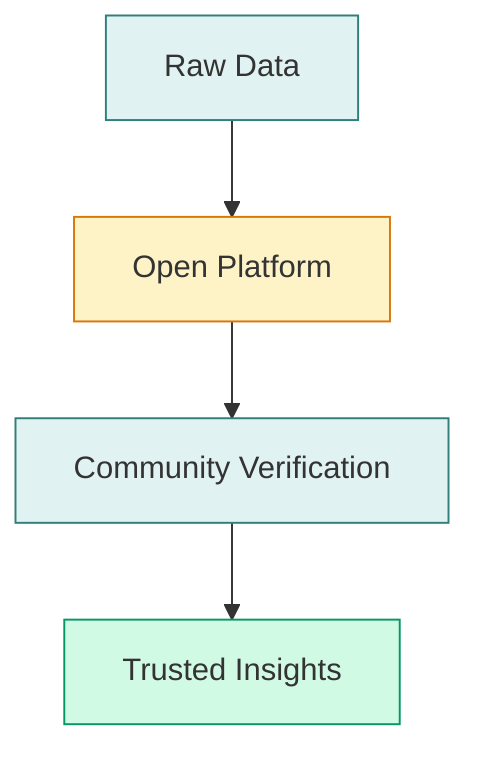

# Walkthru.earth

Cities Built for People

Revealing the hidden patterns of daily life

  <a href="https://walkthru.earth" target="_blank" class="rounded-full px-6 py-2 text-white text-sm font-medium no-underline" style="background: hsl(158 64% 52%)">
    Visit Website
  </a>
  <a href="https://opensensor.space" target="_blank" class="rounded-full px-6 py-2 border-2 text-sm font-medium no-underline" style="border-color: hsl(158 64% 52%); color: hsl(158 64% 52%)">
    OpenSensor.Space
  </a>

---

# The City is Processing You

**Every day, you walk through your city.** You notice the traffic, the buildings, and the shops, but you likely don't notice what the environment is doing to **you**.

  

    

    Walking
  

  

  

    

    Processing
  

  

  

    

    Impact
  

  <strong>Walkthru.earth</strong> believes cities should be built for <strong>people</strong>

  

    
  

---

# The Invisible Problem

**Current cities are measured by spreadsheets, not feelings.**

We track GDP, property values, and traffic flow, but these metrics tell us nothing about whether:

  

    

    A child is thriving
  

  

    

    A resident is chronically stressed
  

  

    

    A neighborhood is truly livable
  

  

Survival Mode

Because we ignore these "hidden patterns," our bodies often stay in <strong>survival mode</strong>.

Chronic noise and pollution keep our **cortisol levels high** and our nervous systems on edge.

---
layout: center
---

# Making the Invisible Visible

Our mission is simple:

"Reveal the hidden patterns of daily life and turn them into solutions."

  

  
Air Quality

  

  
Noise > 65dB

  

  
Green Space

We provide the <strong>"human layer"</strong> of urban intelligence

---

# How We Do It

We've built an infrastructure for <strong>human-centered development</strong> using three core tools:

<a href="https://opensensor.space" target="_blank" class="rounded-xl border-2 p-6 backdrop-blur bg-opacity-10 border-green-500 bg-green-500 h-full no-underline text-inherit hover:scale-105 transition-transform">
  

    

  

  
OpenSensor.Space

  

    A network of DIY stations providing <strong>real-time data</strong> on air, noise, and light
  

</a>

  

    

  

  
Livability Index

  

    A score based on <strong>50+ factors</strong> including food, water, and school access
  

  

    

  

  
Hormones & Cities

  

    Measuring how urban design affects <strong>human behavior and emotions</strong>
  

---

# Why We Are "Open"

We believe urban data should be <strong>public infrastructure</strong>, just like roads and bridges.

  

    

    
Trust

  

  

    All our code is on <a href="https://github.com/walkthru-earth" target="_blank" class="text-green-600 underline">GitHub</a> and our data is public, meaning it can be <strong>verified and audited</strong> by anyone.
  

  

    

    
Equity

  

  

    A community in <strong>Dhaka</strong> has access to the same high-quality tools as a developer in <strong>Dubai</strong>.
  

---

# Who We Help

We turn data into <strong>actionable insights</strong> for everyone

  

    

  

  
For Families

  

    Understanding if a neighborhood is <strong>healthy for their children</strong>
  

  

    

  

  
For Planners

  

    Evidence needed to justify <strong>investing in parks</strong> and livability
  

  

    

  

  
For Investors

  

    The "social impact" data required for <strong>modern ESG reporting</strong>
  

---
layout: center
---

# Our 10-Year Dream

"We are teaching capitalism to care about nervous systems."

  
100,000+

  
Sensor stations by 2036

  
Global

  
Standard for urban success

Measuring success not just by <strong>wealth</strong>, but by <strong>human flourishing</strong>

---

# OpenSensor.Space Live

Real-time environmental sensing network

  <iframe
    src="https://opensensor.space/"
    class="w-full h-full"
    frameborder="0"
    allow="accelerometer; autoplay; clipboard-write; encrypted-media; gyroscope"
  ></iframe>

  <a href="https://opensensor.space" target="_blank" class="text-green-600 underline text-sm">
    Open in new tab 
  </a>

---
layout: center
---

# Join the Path

<a href="https://opensensor.space/join-network/" target="_blank" class="rounded-lg border-2 p-4 backdrop-blur bg-opacity-10 border-green-500 bg-green-50 no-underline text-inherit hover:bg-green-100 transition-all block">
  

  
Deploy a Sensor

</a>

<a href="https://source.coop/walkthru-earth" target="_blank" class="rounded-lg border-2 p-4 backdrop-blur bg-opacity-10 border-amber-500 bg-amber-50 no-underline text-inherit hover:bg-amber-100 transition-all block">
  

  
Access Our Data

</a>

<a href="https://github.com/walkthru-earth" target="_blank" class="rounded-lg border-2 p-4 backdrop-blur bg-opacity-10 border-blue-500 bg-blue-50 no-underline text-inherit hover:bg-blue-100 transition-all block">
  

  
Follow the Journey

</a>

  <a href="https://walkthru.earth" target="_blank" class="text-2xl font-bold no-underline" style="color: hsl(158 64% 52%)">walkthru.earth</a>
  

    <a href="mailto:hi@walkthru.earth" class="text-gray-500 no-underline hover:underline">hi@walkthru.earth</a>
  

---
layout: center
---

  

# The Analogy

Today, cities only check their **"bank balance" (GDP)** to see if they are doing well.

  

    

    
GDP Only

  

  

  

    

    
Full Health

  

Walkthru.earth is like a fitness tracker for the whole city.

We allow a city to finally check its <strong>"heart rate"</strong> and <strong>"stress levels"</strong> so it can actually help the people inside it get healthy.

